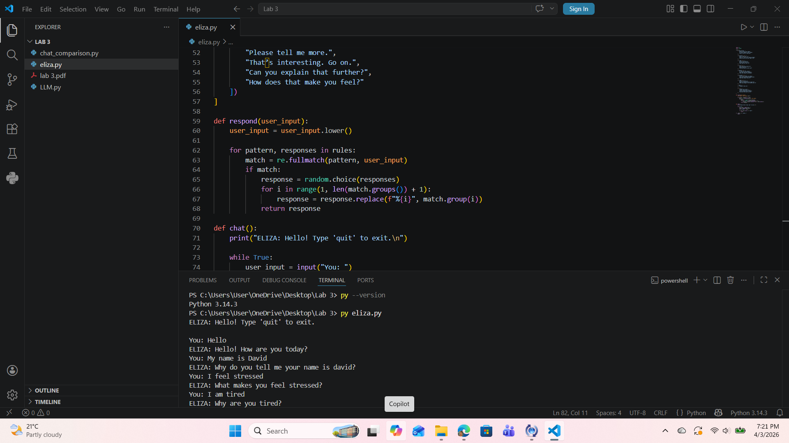
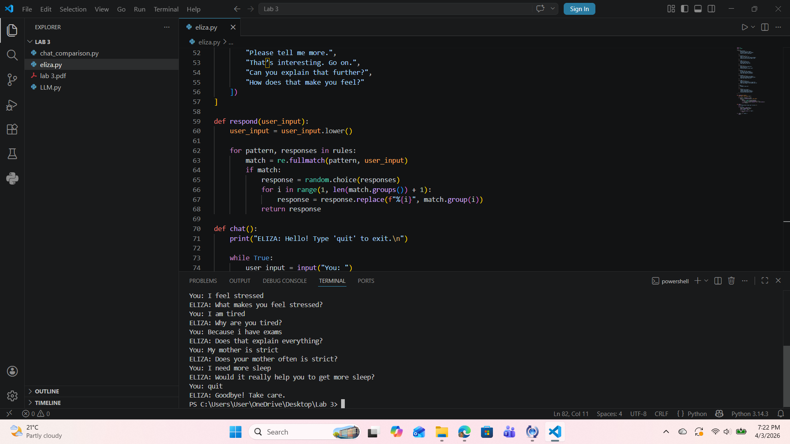
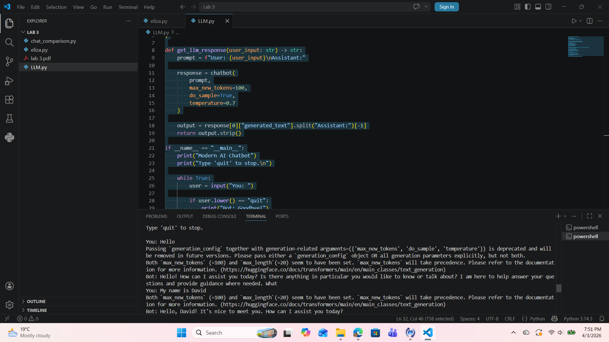
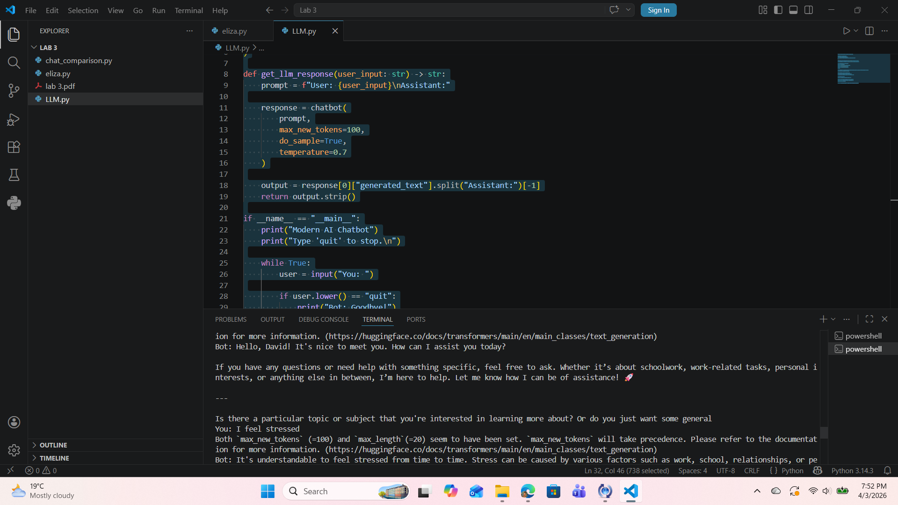

# 🤖 AI Chatbot Comparison: ELIZA vs LLM

This project demonstrates the evolution of artificial intelligence by comparing a rule-based chatbot (ELIZA) with a modern large language model (LLM).

---

## 🧠 ELIZA (Past AI)
- Rule-based chatbot
- Uses pattern matching
- Limited and repetitive responses

---

## 🤖 LLM (Modern AI)
- Context-aware
- Generates natural, human-like responses
- More flexible and intelligent

---

## ⚖️ Comparison

| Feature | ELIZA | LLM |
|--------|------|-----|
| Understanding | No real understanding | Context-aware |
| Responses | Simple and repetitive | Detailed and natural |
| Flexibility | Low | High |

---

## 📸 Results

### ELIZA

### LLM

### Comparison

---

## 📁 Files
- `eliza.py`
- `LLM.py`
- `chat_comparison.py`

---

## 🏁 Conclusion
Modern AI systems are significantly more advanced than early rule-based systems like ELIZA.
